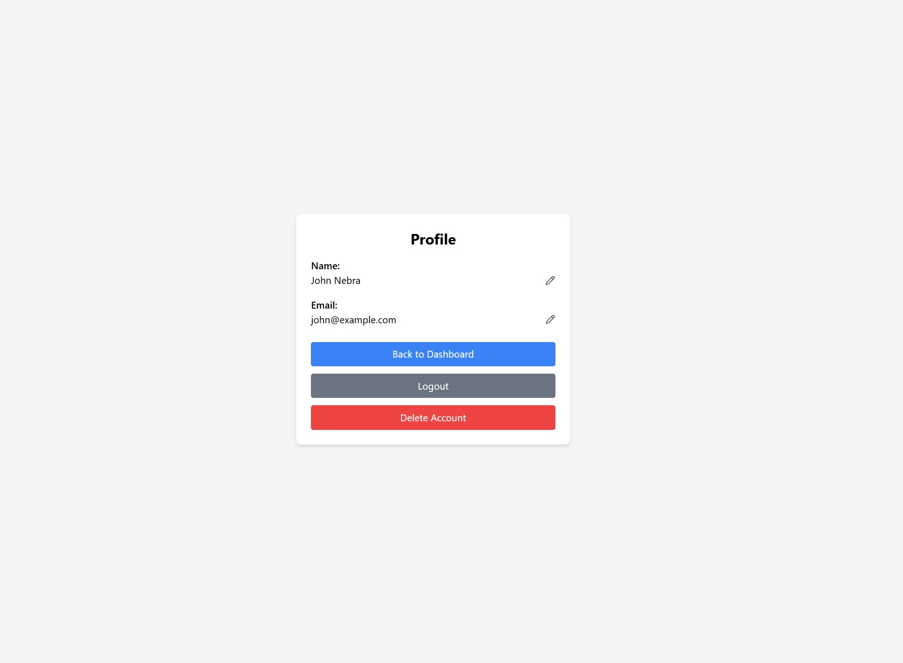
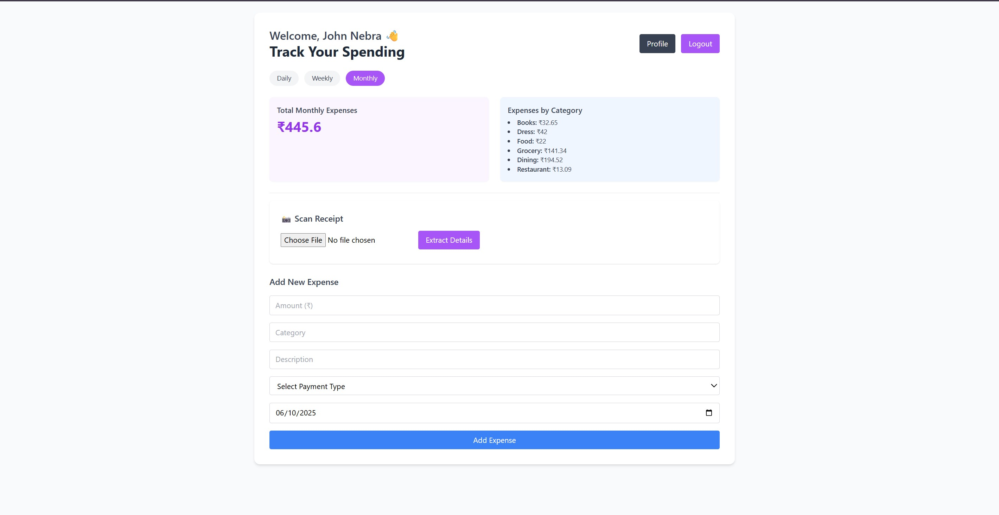

# 💸 Finance Tracker

A sleek and intuitive full-stack web application designed to simplify personal expense management. With a modern interface and smart features like receipt scanning and automatic detail extraction, Finance Tracker helps users stay on top of their finances effortlessly. Built using **React.js** and **Node.js with Express**, and powered by **MongoDB** for robust data handling.

## 🚀 Key Highlights

- 🔐 Secure user authentication (Sign up & Log in)
- 🧾 Add, update, and delete expenses with ease
- 📊 Track total spending and category-wise breakdowns
- 📷 Capture or upload receipts and auto-fill expense data using OCR
- ☁️ Integrated with SonarCloud for continuous code quality analysis
- 🗃️ Reliable MongoDB database integration

## 🛠️ Technology Stack

### Frontend
- **React.js** for dynamic UI
- **Tailwind CSS** for modern styling
- **Axios** for API communication
- **OCR via OpenAI API** for extracting data from images

### Backend
- **Node.js** with **Express.js**
- **MongoDB** with Mongoose ORM
- **JWT Authentication** for session security
- **Multer** for handling image uploads

### DevOps & Tooling
- **Docker** & **Docker Compose** for containerized development
- **GitHub Actions** for CI/CD pipelines
- **SonarCloud** for real-time code analysis

## 📸 Application Screenshots

| Login Page | Profile Page | Dashboard |
|------------|---------------|-----------|
|  |  |  |

## 🧠 Smart Receipt Scanning

Easily scan bills or receipts using your camera or upload from your device. The backend processes the image using an AI-powered OCR engine to extract key details like:

- 💲 **Amount**
- 🏷️ **Category**
- 📝 **Description**
- 💳 **Payment Method**
- 📅 **Date**

Users can review and edit this information before saving it to their dashboard.

## 🧪 Continuous Code Quality with SonarCloud

This project integrates SonarCloud for code health checks, highlighting bugs, code smells, and coverage insights with every push.

🔍 [View SonarCloud Project Dashboard](https://sonarcloud.io/project/overview?id=narayanacharyuluchitroju_finance-tracker)

## 🧭 Project Structure

finance-tracker/
├── finance-tracker-backend/ # Backend: Express.js + MongoDB
│ └── routes/
│ └── controllers/
│ └── middleware/
│ └── models/
├── finance-tracker-frontend/ # Frontend: React.js + Tailwind CSS
│ └── components/
│ └── pages/
│ └── assets/
├── .github/workflows/ # GitHub Actions CI/CD pipelines
├── docker-compose.yml # Docker orchestration
├── .env # Environment variables
└── README.md

## ⚙️ Getting Started

### Prerequisites

- Node.js ≥ 18.x
- Docker & Docker Compose
- MongoDB (or use via Docker)
- OpenAI API key (for OCR)
- SonarCloud token (for CI integration)

## 📁 Environment Setup

Create a `.env` file in both frontend and backend folders:

### `.env` for Backend

PORT=5000
MONGO_URI=mongodb://mongo:27017/finance-tracker
JWT_SECRET=your_jwt_secret
OPENAI_API_KEY=your_openai_api_key

.env for Frontend
REACT_APP_BACKEND_URL=http://localhost:5000

## 🐳 Run with Docker Compose

docker-compose up --build
It will:

Start MongoDB, backend, and frontend services

Backend will run on http://localhost:5000

Frontend will run on http://localhost:3000

🧪 Run Tests
Inside the finance-tracker-frontend directory:

npm test -- --coverage
Test coverage is automatically picked up and pushed to SonarCloud via GitHub Actions on each push to main.

🤝 Contributing
Contributions are welcome! Feel free to fork this repo, raise issues, or open pull requests for improvements.

📄 License
This project is licensed under the MIT License.
